<div align="center">


# Vela

**A modern, fluid and sharp Linux desktop built for today's hardware.**

Vela has its own Wayland compositor and Vulkan renderer, a Qt Quick shell, and a file
manager and settings app built to match. It uses modern hardware where that improves the
experience — smooth motion, precise rendering, rich effects — and avoids overhead where
it does not. Every animation is tied to your monitor's real frames, and fractional scaling
is designed around physical pixels rather than treated as an afterthought.

[](https://github.com/BrandoDev/vela/actions/workflows/build.yml)

[](LICENSE)


[Screenshots](#screenshots) · [Features](#features) · [Install](#install) ·
[Build](#build-from-source) · [How it works](#how-it-works) · [Docs](#documentation) · [Roadmap](#roadmap)

<br>

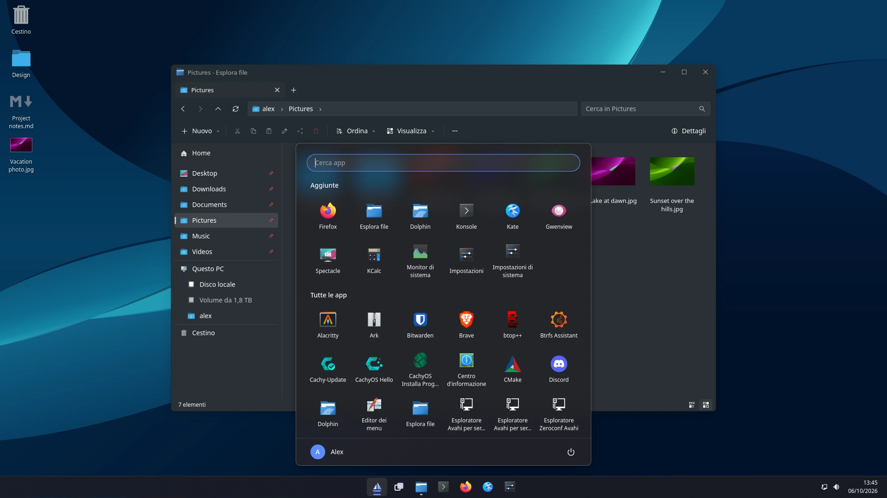

</div>

---

## Why Vela

Desktop hardware and displays have moved fast. A desktop should feel like it belongs on
them. Vela aims for contemporary interaction design, high-refresh motion and precise
rendering without treating visual quality and efficiency as opposing goals.

> **Use hardware when it improves the experience. Avoid overhead when it doesn't.**
> Vela does not remove motion or effects just to win a memory chart. Efficiency comes
> from doing less unnecessary work, not from making the desktop feel less modern.

<table>
<tr>
<td width="50%" valign="top">

### Modern
A coherent shell, polished motion, snap layouts, virtual desktops, quick settings,
notifications and a file manager designed as one desktop rather than a collection of
unrelated utilities. Vela targets current hardware and modern displays on purpose.

</td>
<td width="50%" valign="top">

### Fluid
Animations advance on real vblanks, never arbitrary timers: at 180 Hz they can take 180
steps per second. Late latching draws as late as safely possible before each vblank.
Fullscreen games can go straight to the display through direct scanout, with VRR and
tearing support where appropriate.

</td>
</tr>
<tr>
<td width="50%" valign="top">

### Sharp
Fractional scaling is pixel-exact when an app renders at the screen's scale: its buffer
can be copied 1:1 with no filtering, even at 125% or 175%. An automated test checks this
bit for bit after opening, snapping, maximizing and restoring a window.

</td>
<td width="50%" valign="top">

### Efficient
Efficiency through architecture, not austerity. Damage tracking avoids drawing what did
not change, direct scanout bypasses compositing when possible, and native components stay
responsive without heavyweight runtimes for simple desktop UI. The compositor idles at
**17 MiB** and **0.1% CPU** on the primary development system.

</td>
</tr>
</table>

## Screenshots

<table>
<tr>
<td width="50%">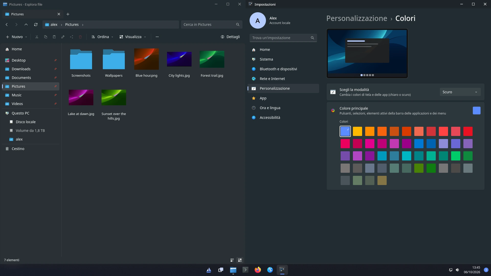<br><sub><b>Snap</b>: windows side by side with Super+arrows or by dragging to an edge or corner.</sub></td>
<td width="50%">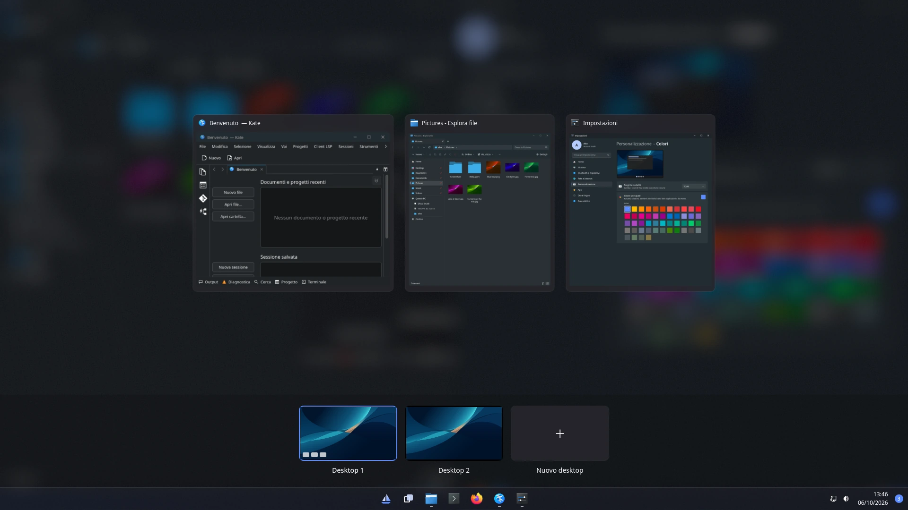<br><sub><b>Task View</b> (Super+Tab): live window previews and virtual desktops.</sub></td>
</tr>
<tr>
<td width="50%">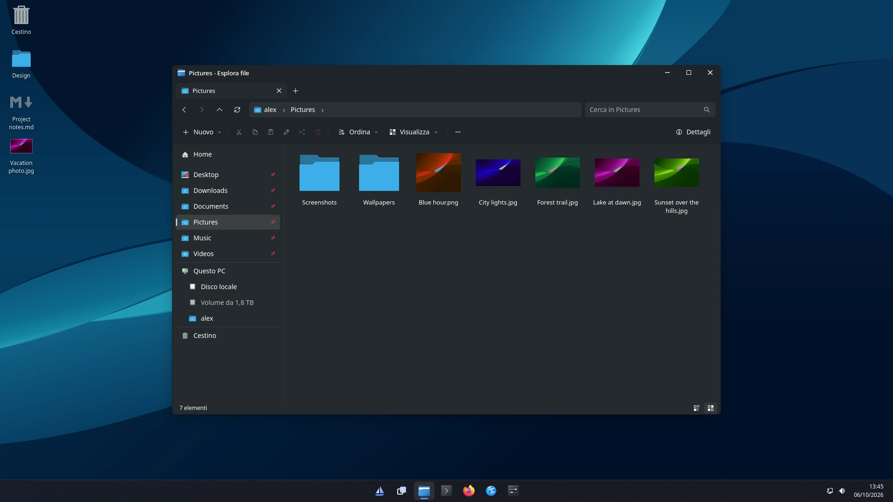<br><sub><b>Files</b>: tabs, breadcrumbs, thumbnails and previews; first frame in about 100 ms.</sub></td>
<td width="50%">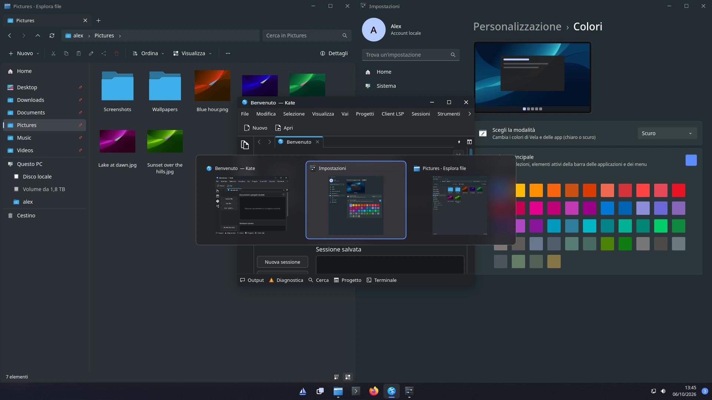<br><sub><b>Alt+Tab</b> with previews, minimized windows included.</sub></td>
</tr>
<tr>
<td width="50%">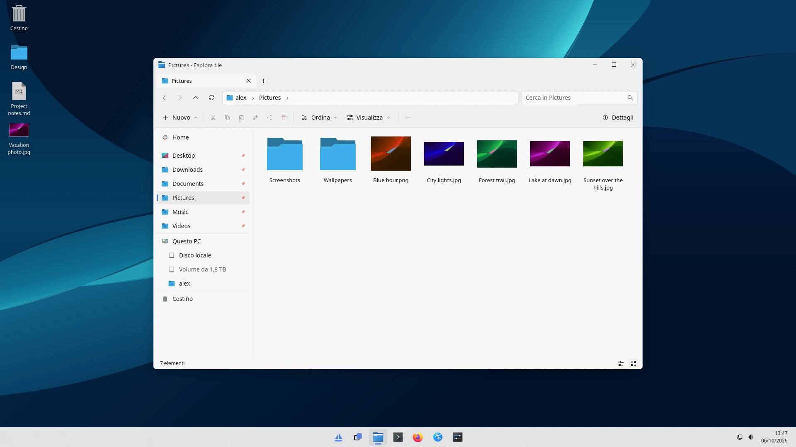<br><sub><b>Light and dark</b> modes for the shell and for apps, switched instantly.</sub></td>
<td width="50%">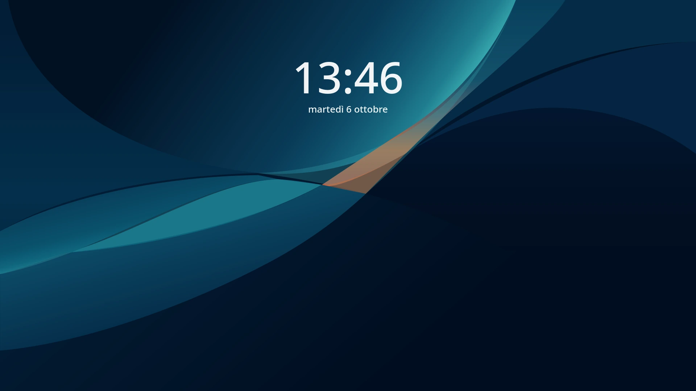<br><sub><b>Lock screen</b>: built on ext-session-lock, so a crash never reveals the desktop.</sub></td>
</tr>
</table>

<table>
<tr>
<td width="34%" valign="top">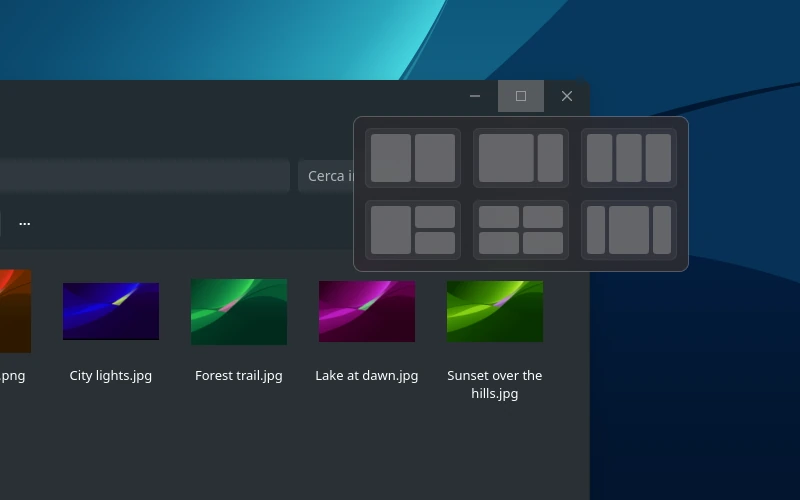<br><sub><b>Snap layouts</b>: hover the maximize button or press Super+Z.</sub></td>
<td width="33%" valign="top">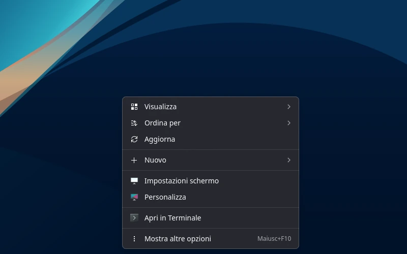<br><sub><b>Context menus</b> with a compact primary view and KDE service menus under "Show more options".</sub></td>
<td width="33%" valign="top">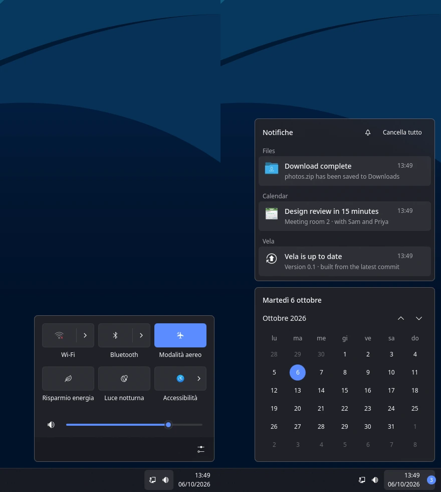<br><sub><b>Quick settings</b> (Super+A) and the <b>notification center</b> (Super+N).</sub></td>
</tr>
</table>


## It owns the whole pipeline

A modern shell is only the surface. Vela also controls the path underneath it, from the
moment an app commits a Wayland surface to the moment the pixel lights up on your monitor.

```
input → state → predicted frame → render as late as possible → presentation feedback → correct the model
```

- **Its own scene graph and Vulkan renderer** on top of wlroots, with no `wlr_scene` and
  no wlroots renderer. Flattening, occlusion, damage history with buffer age, damage
  expanded for blur, and per-surface pacing are all Vela's.
- **A frame clock that models time.** Each output keeps a grid of real vblanks and
  measures what frames cost (worst case over the last second). It starts rendering as
  late as it safely can and widens its margin after a miss. It even tells a slow frame
  apart from constant latency added by a host compositor.
- **A slow app can't hold the screen back.** A commit whose buffer the app's GPU is
  still drawing waits for its fence (explicit or implicit sync), and until then the
  screen keeps the app's previous frame: the cursor, the animations and every other
  window stay on the vblank. Buffers stay imported only while they're on screen, because
  the kernel would otherwise make every frame wait for each app redrawing one of them.
  Measured with an app whose GPU finishes 150 ms late: 0 missed vblanks, down from 47.
- **Direct scanout done properly.** A single opaque surface covering the output 1:1
  goes straight to the display plane, with dmabuf feedback and explicit-sync timelines.
  The moment that stops being true, Vela falls back to compositing.
- **Fractional scaling it can prove.** Exact preferred scales, pixel-snapped
  positions, and nearest sampling whenever a buffer maps 1:1, verified bit for bit by
  an automated test.

The whole design is written down in [docs/renderer.md](docs/renderer.md).

> [!NOTE]
> **Vela is alpha software.** You can already pick it at the login screen and use it
> every day: compositor, shell, file manager, settings, lock screen. The complete GPU-
> dependent functional and sharpness suites are run on the primary development machine
> and currently pass; GitHub-hosted CI skips them because it has no usable DRM/Vulkan
> device. Some hardware-specific paths still rely on manual verification. The interface
> speaks **English and Italian** (Settings → Time & language), switched live.

## Features

### Window management and multitasking
- **Snap layouts**: halves, quarters, and six layouts (thirds, 2/3 + 1/3,
  and more). **Snap Assist** offers your other windows for the empty space. Windows you
  arrange this way form a **snap group** that the taskbar shows and restores together.
- **Task View and virtual desktops** (Super+Tab): drag windows between desktops,
  rename and reorder desktops, and switch with Super+Ctrl+←/→ and a sliding animation.
  Your desktops are remembered across sessions.
- **Alt+Tab** with live previews, including minimized windows. A quick Alt+Tab just
  switches without showing the panel.
- **Window animations**: windows fade and rise as they open, shrink away as they close,
  and fly into their taskbar button when minimized.
- **Rounded corners and soft shadows**, drawn by the compositor and sharp at every
  scale. They turn off when a window is maximized, snapped or fullscreen.
- **Vela's own title bar** for apps that accept server-side decorations (Qt, KDE, X11),
  with the app icon and a wallpaper-tinted translucent surface. Apps that draw their own
  title bar, such as Chromium with tabs on top, keep theirs.
- Invisible resize borders, Super+drag to move, Super+right-drag to resize, and a window
  menu (Alt+Space) with keyboard move and resize.

### Shell
- **Taskbar**: pinned and running apps centered (or left-aligned), drag to reorder, jump
  lists with recent files, **hover previews**, a system tray (StatusNotifierItem), and
  one taskbar per monitor.
- **App launcher**: instant search, pinned apps, keyboard navigation, and a Super+X power-user menu.
- **Quick settings** (Super+A): Wi-Fi network picker, Bluetooth, airplane mode, power
  mode, Night light, accessibility, brightness, volume and battery, and a sound page
  (Super+Ctrl+V) to pick the output, see Bluetooth headsets' charge, and set each app's
  volume and output.
- **Media and volume keys** that work whatever has the focus, with a volume indicator;
  the wheel over an app's taskbar button sets that app's volume.
- **Notifications** with actions, a **notification center** with a calendar (Super+N),
  and Do Not Disturb.
- **Clipboard history** (Super+V): text and images, pinned items that survive a reboot,
  and one-click paste into the focused app.
- **Snipping tool** (Super+Shift+S or PrtSc): capture a rectangle, a window or a full
  screen, straight to the clipboard and to `Pictures/Screenshots`.
- **Desktop icons** with thumbnails, drag and drop to and from apps, Properties, and
  undo. Also **Run** (Super+R) and **Show desktop** (Super+D).
- **Light and dark** modes and a coordinated accent palette, applied to KDE and GTK apps
  too.

### Files (`vela-files`)
- Tabs, breadcrumb address bar, search in subfolders, Details and icon views (remembered
  per folder), and a **preview pane** (images, text, video and PDF thumbnails).
- Background copy and move with progress and conflict resolution, drag and drop
  everywhere, ZIP/7z/TAR, shortcuts, Favorites, Trash with restore.
- **Atomic file replacement and staged copies.** Each file is written to a hidden temporary
  next to its destination and renamed into place only once complete. Replacing a file keeps
  the previous contents until the new copy is safely written, so a full disk or read error
  does not turn a good destination file into a partial one.
- **Unmounted drives** (udisks) in This PC: double-click to mount, eject from the menu.

### Settings (`vela-settings`)
- **Displays**: drag-and-drop arrangement, scale, resolution, refresh rate, rotation, and
  "Keep these settings?" with automatic revert. Also **Night light**, variable refresh
  rate and tearing.
- **Sound, Notifications, Power, Clipboard**, Bluetooth and devices, **mouse and
  touchpad** (tap to click, scroll direction, three- and four-finger gestures), and
  Network.
- **Personalization**: wallpaper, colors, taskbar. **Apps**: installed and default apps.
  **Time and language**: date and time, keyboard layouts.
- **Accessibility**: magnifier, color filters, sticky keys.

### Graphics and gaming
- Vela's **own scene graph and Vulkan 1.4 renderer**: no `wlr_scene`, no GL fallback.
- **Live acrylic blur** (dual Kawase) behind the shell, exposed to apps through the
  standard `ext-background-effect-v1` protocol.
- **Direct scanout** for fullscreen apps, **VRR** (FreeSync/G-Sync, automatic for
  fullscreen apps by default), **tearing control** for games, explicit sync
  (`linux-drm-syncobj-v1`), relative pointer and pointer constraints.
- **Night light** in the monitor's gamma LUT, so screenshots stay untinted and games keep
  direct scanout. It can follow sunset and sunrise, computed offline from your time zone.
- Picks the **highest refresh rate** at native resolution, even when the monitor
  advertises 60 Hz as "preferred".
- **Xwayland** on demand for Steam, games and older apps.

### Accessibility and input
- Magnifier (Super+Plus), grayscale and color-blindness filters (Super+Ctrl+C), and sticky
  keys.
- Familiar touchpad defaults and gestures: three or four fingers up for Task View,
  down for the desktop, sideways to switch apps or desktops.

### A session you can rely on
- **Crash recovery.** A tiny supervisor holds the Wayland socket. If the compositor
  crashes, a new one starts on the same socket and Qt/KDE apps reconnect and reappear,
  as with KWin. If the screen was locked, Vela comes back **locked**. Three crashes in a
  minute end the session cleanly.
- If the shell crashes, the compositor restarts it, and your windows stay open.
- A **secure lock screen** (`ext-session-lock-v1`): if the locker dies, the screen stays
  black and locked, and the locker is restarted.
- **Integrates with KDE's services**: portals, polkit agent, the KDE wallet (so Chrome,
  Brave and VS Code keep their logins), color schemes and icon themes.

## Install

Vela needs a GPU with **Vulkan 1.4**: AMD or Intel with Mesa ≥ 25.0, or NVIDIA with the
proprietary driver ≥ 570 or NVK. Once installed, **Vela** appears on the login screen
(SDDM or Plasma Login) next to Plasma.

### Arch Linux, CachyOS, EndeavourOS

Vela installs as a proper `vela-git` package:

```sh
git clone https://github.com/BrandoDev/vela.git
cd vela/packaging/arch
VELA_GIT_URL=file://$PWD/../.. makepkg -si
```

Then keep it up to date with **`vela-update`**. It fetches new commits, shows what
changed, and installs the new version. Every push to `main` is built on GitHub
Actions, so if that package is ready (and the [GitHub CLI](https://cli.github.com/) is
logged in), `vela-update` offers to download it instead of compiling. Otherwise it
builds the package locally.

```sh
vela-update                 # update if something new is available
vela-update --check         # only check, and list the changes
vela-update --download      # use GitHub's package without asking
vela-update --build         # always build locally
vela-update --jobs 2        # fewer parallel compile jobs
vela-update --branch fix/nvidia --download  # test this branch's latest commit
vela-update --commit abc1234 --download    # test an exact commit
```

`--branch` and `--commit` apply only to that invocation and cannot be combined.
The next plain `vela-update` returns to the repository's default branch (`main`
on GitHub), including when this means installing an older version. Commit SHAs
may be full or abbreviated, provided the abbreviation is unambiguous.
Both options also work with `--check` and `--build`; local builds use the exact
selected commit too. `--download` uses that commit's CI package if available,
otherwise it builds locally as usual.

To prepare a package for a test branch, run the **Build** workflow manually in
GitHub Actions, selecting that branch (or run
`gh workflow run build.yml --ref fix/nvidia`). Manual runs produce the same
`vela-git` artifact as pushes to `main`; artifacts expire after 14 days.
The tester needs a version of `vela-update` that already supports these options.

The last three packages stay in `~/.cache/vela-update` for easy rollback.

### Other distributions

Build from source (below), then:

```sh
sudo cmake --install build   # into /usr/local, plus /etc/pam.d and /etc/xdg
```

If the session doesn't show up, your display manager may not look in `/usr/local`:

```sh
sudo ln -s /usr/local/share/wayland-sessions/vela.desktop /usr/share/wayland-sessions/
```

## Build from source

You need CMake ≥ 3.22, Ninja, a C17 and C++20 compiler, **wlroots 0.20**, Qt ≥ 6.7 with its Linguist tools, LayerShellQt,
the Vulkan headers and loader, `glslc`, GBM, libdrm, FreeType, HarfBuzz, Fontconfig and
PAM. librsvg is optional (app icons in the title bar). The tests also use GoogleTest and
Python 3.

<details>
<summary><b>Arch / CachyOS / EndeavourOS</b></summary>

```sh
sudo pacman -S --needed base-devel cmake ninja pkgconf wlroots0.20 wayland-protocols \
    libxkbcommon pixman libinput qt6-declarative qt6-svg qt6-wayland qt6-tools layer-shell-qt \
    vulkan-headers vulkan-icd-loader shaderc mesa libdrm freetype2 harfbuzz fontconfig \
    pam librsvg zlib gtest python
```
</details>

<details>
<summary><b>Fedora</b></summary>

```sh
sudo dnf install cmake ninja-build gcc-c++ wlroots-devel wayland-devel wayland-protocols-devel \
    libxkbcommon-devel pixman-devel libinput-devel qt6-qtdeclarative-devel qt6-qttools-devel \
    qt6-qtsvg-devel qt6-qtwayland-devel layer-shell-qt-devel \
    vulkan-headers vulkan-loader-devel glslc mesa-libgbm-devel libdrm-devel \
    freetype-devel harfbuzz-devel fontconfig-devel pam-devel librsvg2-devel \
    zlib-devel gtest-devel python3
```
</details>

<details>
<summary><b>openSUSE Tumbleweed</b></summary>

```sh
sudo zypper install cmake ninja gcc-c++ wlroots-devel wayland-protocols-devel \
    libxkbcommon-devel pixman-devel libinput-devel qt6-declarative-devel qt6-linguist-devel \
    qt6-svg-devel qt6-waylandclient-devel layer-shell-qt6-devel \
    vulkan-headers vulkan-devel shaderc libgbm-devel libdrm-devel \
    freetype2-devel harfbuzz-devel fontconfig-devel pam-devel librsvg-devel \
    zlib-devel gtest python3
```
</details>

```sh
cmake -B build -G Ninja
cmake --build build
```

### Try it without logging out

From a running Wayland session (Plasma, for example), Vela opens in a window like a
virtual monitor:

```sh
sh scripts/run-nested.sh
```

The host desktop keeps the Super key, so every shortcut also has an Alt variant (below).
These Alt variants are only active when nested. In a real session, Alt+letter stays with
your apps for their menu mnemonics.

## Keyboard shortcuts

Vela uses familiar desktop shortcuts: <kbd>Super</kbd> opens the app launcher,
<kbd>Super</kbd>+<kbd>Tab</kbd> opens Task View, <kbd>Super</kbd>+arrow keys snap windows,
and <kbd>Super</kbd>+<kbd>A</kbd>/<kbd>N</kbd>/<kbd>V</kbd> open quick settings,
notifications and clipboard history.

When Vela runs nested inside another Wayland desktop, Alt-based alternatives are enabled
for shortcuts that the host would otherwise capture.

See **[docs/shortcuts.md](docs/shortcuts.md)** for the complete normal and nested-session
shortcut reference.

## How it works

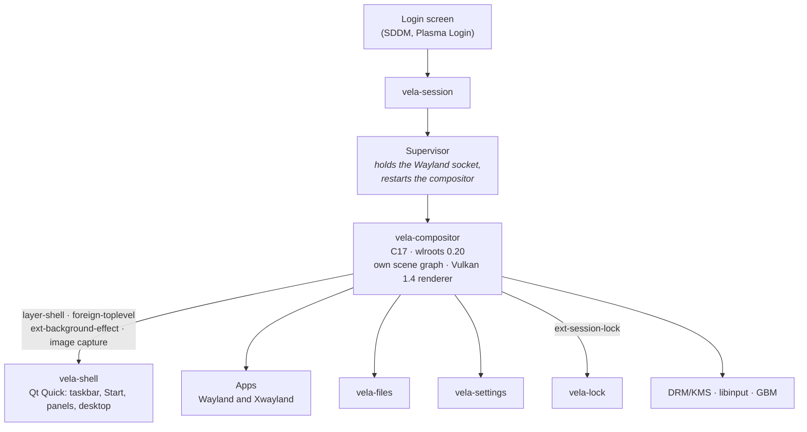

- **The compositor** owns the screen (see [above](#it-owns-the-whole-pipeline)). Its
  Vulkan 1.4 renderer draws SDF rounded corners, analytic two-layer shadows, dual Kawase
  blur and night light in the gamma LUT. It also implements `wlr_renderer`, so wlroots'
  cursor, screencopy and shm uploads share the same device.
- **The shell** is a separate Qt Quick process using LayerShellQt. It talks to the
  compositor through standard Wayland protocols, plus a small command socket (for
  example, Super opens Start). A shell crash never takes your windows down.
- **Motion design lives in one place**: `compositor/src/motion.h` and
  `shell/qml/Theme.qml` share the same cubic-bezier(0, 0, 0.2, 1) curve.
- **The session** declares itself `XDG_CURRENT_DESKTOP=Vela:KDE`. Qt/KDE apps use KDE's
  theme, and browsers and Electron apps use KDE's wallet, exactly as inside Plasma. It
  connects to systemd (`vela-session.target`), starts the portals and the polkit agent,
  and keeps the last two session logs in `~/.local/state/vela/`.

## Performance

Vela does not chase low resource usage by stripping away the experience. It measures
overhead so visual ambition does not quietly turn into waste:


| Goal | Target | Today |
|---|---|---|
| Start menu | visible on the next frame after the key | ✔ |
| Context menus | visible on the next frame after the click | ✔ |
| Files cold start | first frame within 150 ms | **104 ms** (median of 5) |
| Animations | always driven by real vblanks, never timers | ✔ |
| Compositor at idle | no CPU, few wakeups | **17 MiB**, **0.1% CPU**, 3–7 wakeups/s |
| Shell at idle | no CPU, few wakeups | **143 MiB**, **0.1% CPU**, 1–4 wakeups/s |

These measurements are from Vela's primary development system (Ryzen 9 9950X, Radeon
RX 9070 XT, CachyOS, Mesa/RADV). Numbers come from `scripts/measure.sh`, which samples
PSS memory, idle CPU, wakeups per second and, on battery, average power draw over 30
seconds. `--json` prints one line to compare over time.

## Development

Vela can be run nested inside the current Wayland session or headlessly for automated
work:

```sh
sh scripts/run-nested.sh
sh scripts/run-headless.sh
```

Build and run the complete CTest suite with:

```sh
cmake -B build -G Ninja
cmake --build build
ctest --test-dir build --output-on-failure
```

The GPU-dependent functional and sharpness suites use Vela's real Vulkan renderer. They
are run regularly on the primary development machine — an AMD Radeon RX 9070 XT with
Mesa/RADV — and currently pass in full. GitHub-hosted CI runs the CPU-only tests and
skips GPU suites because hosted runners do not expose a usable DRM/Vulkan device.

For the full workflow, test harness, command socket, debug switches and project layout,
see the documentation below.

## Documentation

| Document | Contents |
|---|---|
| **[Renderer](docs/renderer.md)** | Scene graph, Vulkan renderer, scaling, damage, frame scheduling and direct scanout. |
| **[Development](docs/development.md)** | Build options, nested/headless workflows, development tools and repository layout. |
| **[Testing](docs/testing.md)** | Unit, functional and sharpness suites; GPU requirements; local and CI coverage. |
| **[Configuration](docs/configuration.md)** | `vela.conf`, display persistence, runtime overrides and renderer/debug environment variables. |
| **[Keyboard shortcuts](docs/shortcuts.md)** | Complete normal-session and nested-session shortcut reference. |

## Roadmap

**Done**
- [x] **A real session**: login entry, systemd and D-Bus, portals, polkit, Xwayland,
  lock screen, idle, notifications, system tray.
- [x] **The look**: own Vulkan renderer, live acrylic blur, rounded corners and
  shadows, Vela's title bar, and modern context menus throughout the shell.
- [x] **A complete daily desktop**: Settings, Files, desktop icons, virtual desktops,
  Task View, Snap layouts and Snap Assist, light mode.
- [x] **Gaming and displays**: tearing control, VRR, direct scanout, multi-monitor
  hotplug with per-output scale.
- [x] **Daily comfort**: clipboard history, snipping tool, touchpad gestures, mouse and
  touchpad settings.
- [x] **Reliability**: compositor crash recovery, package and `vela-update`, CI.
- [x] **Languages**: English and Italian, switched live from Settings.

**Next**
- [ ] Input methods (`text-input`, `input-method`) and an emoji panel (Super+.).
- [ ] An Updates page in Settings, with a notification when a new version is out.
- [ ] Start menu: Recommended files, and search across files and settings.
- [ ] Screen recording in the snipping tool.
- [ ] More languages.
- [ ] Vela's own login screen.
- [ ] HDR and color management.

## Contributing

Vela is a young project and moves fast. Issues and ideas are welcome. Before larger
changes, open an issue to talk about it. Code, messages and interface text are in English;
code comments are still in Italian. Please sign off your commits (`git commit -s`, the
[Developer Certificate of Origin](https://developercertificate.org/)): contributions
are accepted under the project's license, GPL-3.0-or-later.

## Acknowledgements

Vela stands on the shoulders of [wlroots](https://gitlab.freedesktop.org/wlroots/wlroots),
[Qt](https://www.qt.io/), [KDE Frameworks and Plasma](https://kde.org/) (LayerShellQt,
Breeze icons, the portals and the wallet), [Mesa](https://mesa3d.org/) and the Wayland
protocols community.

## License

Vela is free software: you can redistribute it and/or modify it under the terms of the
[GNU General Public License](LICENSE) as published by the Free Software Foundation,
either version 3 of the License, or (at your option) any later version.

Every source file and the artwork in `images/` carry an
`SPDX-License-Identifier: GPL-3.0-or-later` header. The Wayland protocol files in
`protocols/` keep their original MIT-style licenses.
